# 18 NoSQL: Jenny's Social Network API

## Description

My task for this Challenge was to build an API for a social network web application, where users can share their thoughts, react to friends’ thoughts, and create a friend list. 
MongoDB is a popular choice for many social networks due to its speed with large amounts of data and flexibility with unstructured data. Because the foundation of this applications is data, it was important to me to understand how to build and structure the API using MongoDB. I added my own seed data to this application.
I used Express.js package for routing, a MongoDB database, the Mongoose ODM and the Moment.js library for this application. 


This app will follow the user story and acceptance criteria below:

## User Story

```md
AS A social media startup
I WANT an API for my social network that uses a NoSQL database
SO THAT my website can handle large amounts of unstructured data
```

## Acceptance Criteria

```md
GIVEN a social network API
WHEN I enter the command to invoke the application
THEN my server is started and the Mongoose models are synced to the MongoDB database
WHEN I open API GET routes in Insomnia for users and thoughts
THEN the data for each of these routes is displayed in a formatted JSON
WHEN I test API POST, PUT, and DELETE routes in Insomnia
THEN I am able to successfully create, update, and delete users and thoughts in my database
WHEN I test API POST and DELETE routes in Insomnia
THEN I am able to successfully create and delete reactions to thoughts and add and remove friends to a user’s friend list
```


## Usage

This application won’t be deployed, however here is a link to a walk through video that demonstrates its functionality and all of the following acceptance criteria being met:

- https://youtu.be/W7w8gtvCBbk 

## Credits

- [Express.js](https://www.npmjs.com/package/express)
- [Mongoose](https://www.npmjs.com/package/mongoose)
- [Moment.js](https://momentjs.com/docs/)
- [Web MDN locales](https://developer.mozilla.org/en-US/docs/Web/JavaScript/Reference/Global_Objects/Intl/DateTimeFormat/DateTimeFormat#locales)
-  [MongoDB installation guide on The Full-Stack Blog](https://coding-boot-camp.github.io/full-stack/mongodb/how-to-install-mongodb)


- Mock up examples:

The following animations show examples i was given of what the application's API routes being tested in Insomnia should look like:

The following animation shows GET routes to return all users and all thoughts being tested in Insomnia:


The following animation shows GET routes to return a single user and a single thought being tested in Insomnia:


The following animation shows the POST, PUT, and DELETE routes for users being tested in Insomnia:


In addition to this, your walkthrough video should show the POST, PUT, and DELETE routes for thoughts being tested in Insomnia.

The following animation shows the POST and DELETE routes for a user’s friend list being tested in Insomnia:


In addition to this, your walkthrough video should show the POST and DELETE routes for reactions to thoughts being tested in Insomnia.


## Screenshots
These screenshots show my app's functionality:
- The Terminal, an example of how to invoke the application's server: 
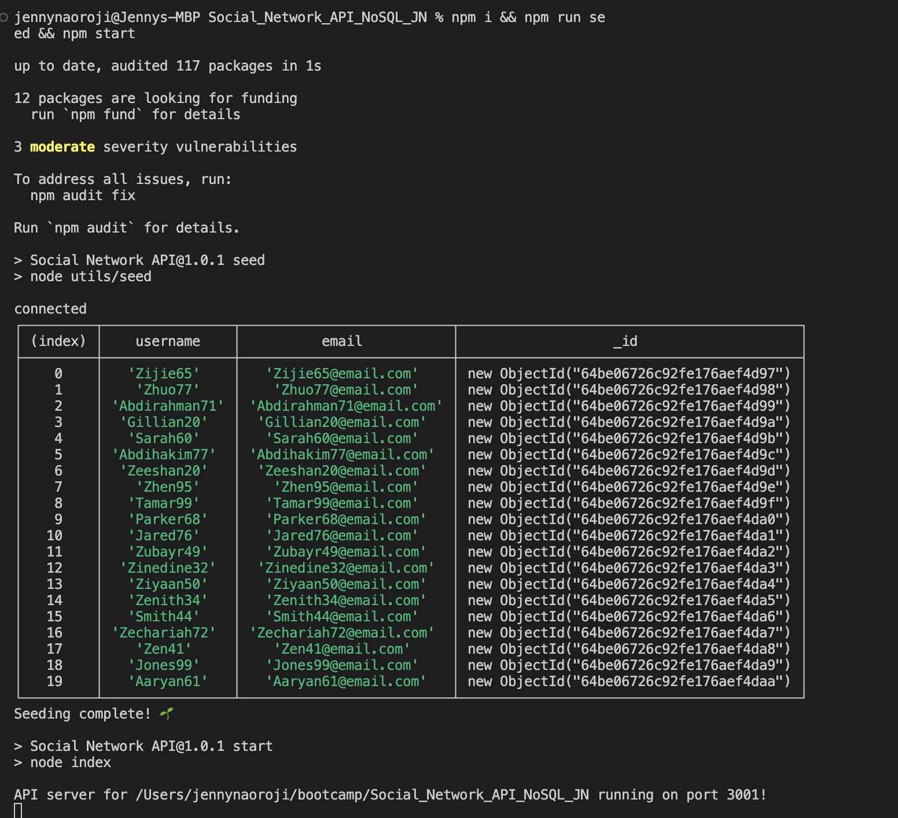

- GET route for ALL Users: 
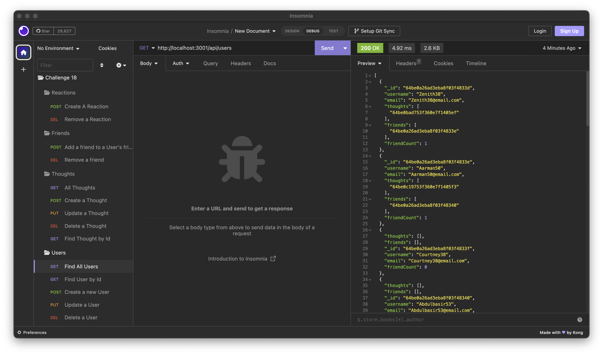

- GET route for ALL Thoughts: 
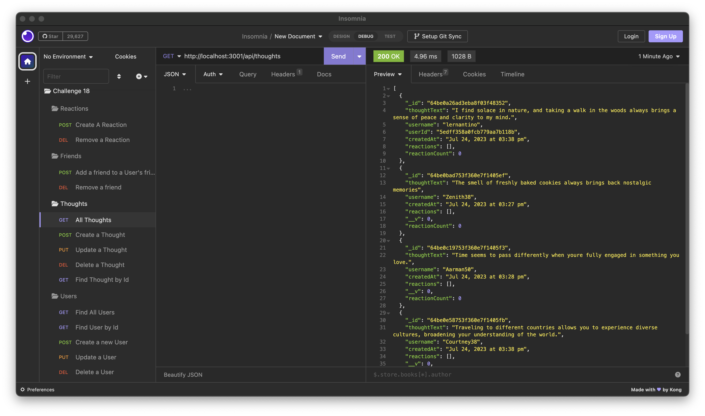

- GET route for Users by ID: 
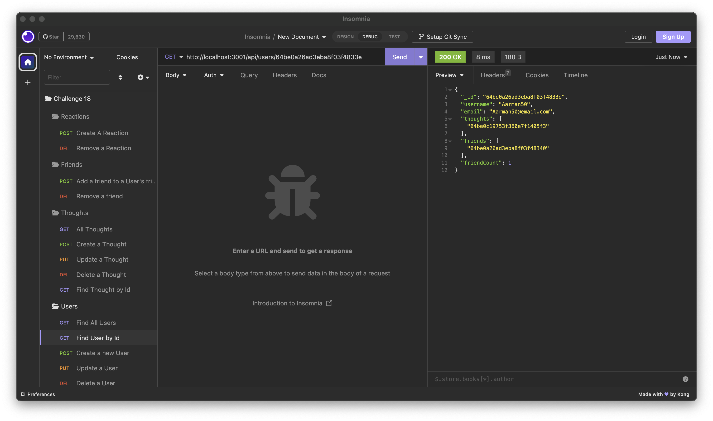

- GET route for Thoughts by ID: 
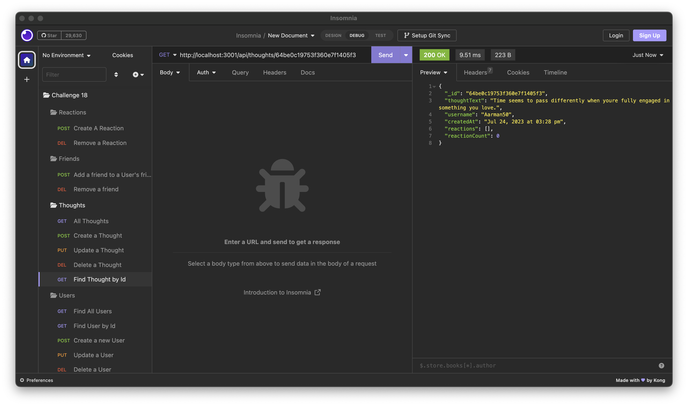

- POST route for Users: 


- PUT route for Users: 
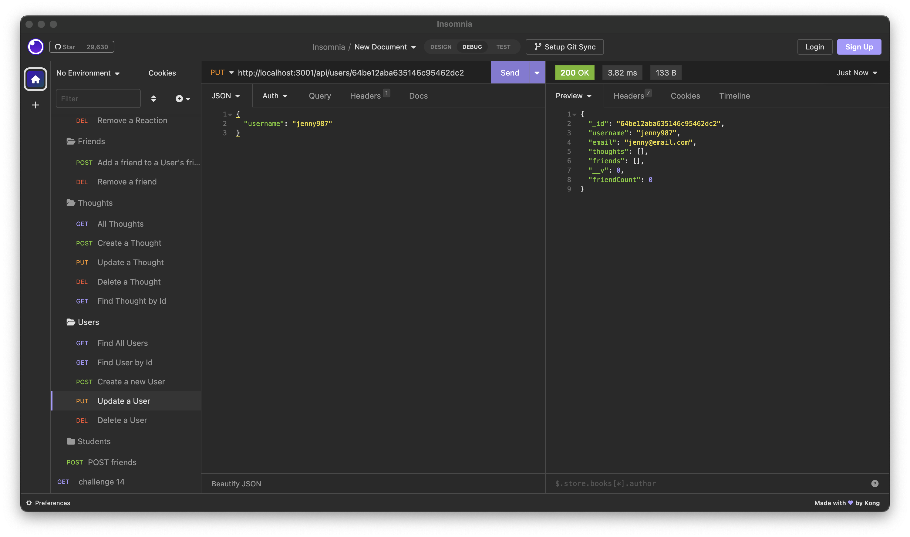

- DELETE route for Users (also deletes associated thoughts): 


- POST route for Thoughts: 
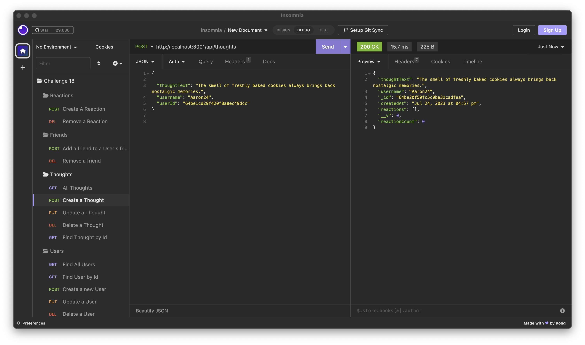

- PUT route for Thoughts: 


- DELETE route for Thoughts (also deletes associated reactions): 
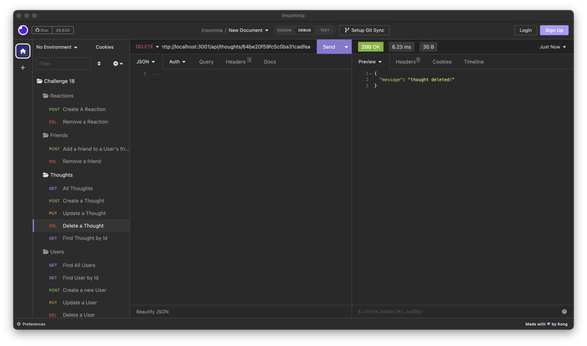


- POST route for Friends: 
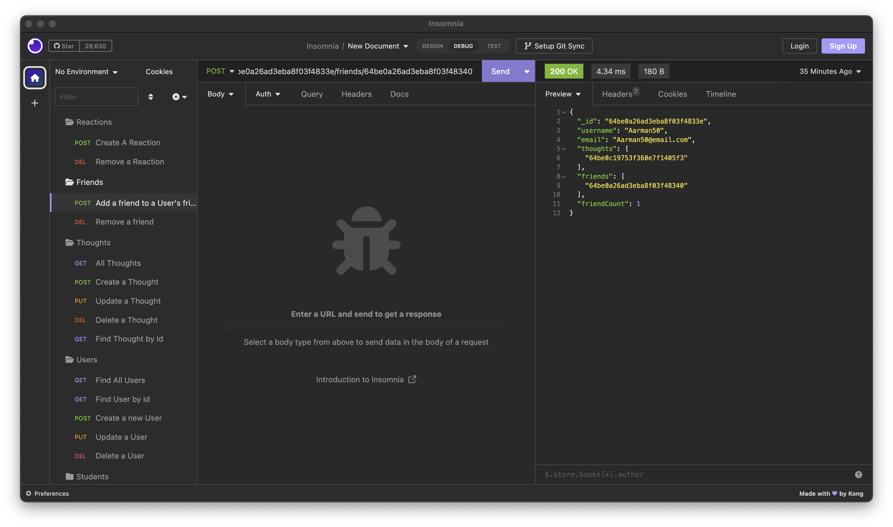

- DELETE route for Friends: 
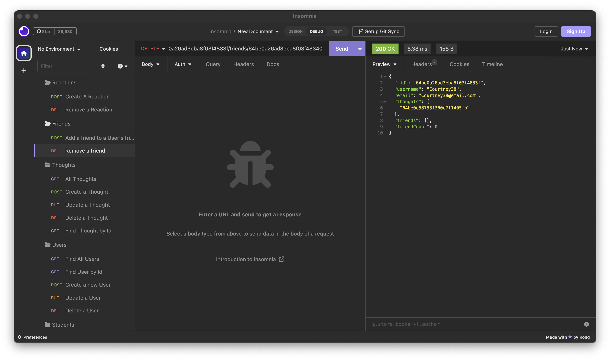

- POST route for Reactions: 
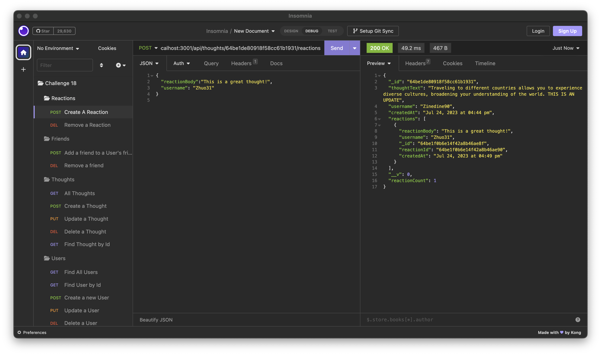

- DELETE route for Reactions: 
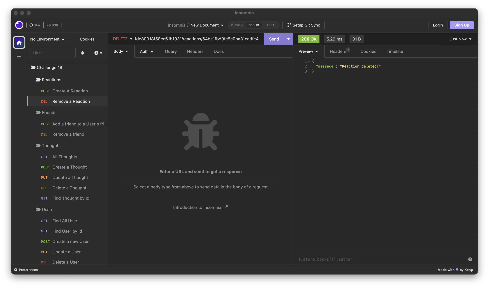


## License

[](https://opensource.org/licenses/MIT)
Please refer to the LICENSE in the repo or click on the badge for documentation.
